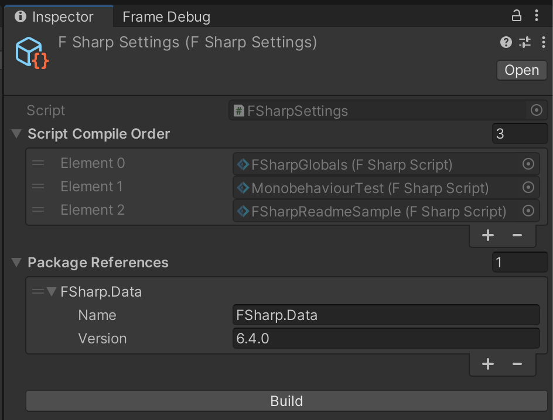

# F# for Unity
Experimental support for F# scripting in Unity: create F# scripts with the `.fs` file extension and they'll be built automatically using the [.NET SDK](https://dotnet.microsoft.com/).


## Features
- Automatically installs the [.NET SDK](https://dotnet.microsoft.com/) locally inside your `Library` folder
- Automatically compiles F# scripts (`.fs` files) to a DLL usable by Unity
  + The DLL and its dependencies are generated at `Assets/FSharpOutput`.
    Consider ignoring this folder in your VCS (e.g.: adding to `.gitignore` file in Git repos).
  + The DLL references the same DLLs as `Assembly-CSharp` does.
  + Scripts inside `Editor` folders are only available in the Unity editor
- Supports defining script compilation order in the `Assets/Editor/FSharpSettings` asset
- Supports defining package references in the `Assets/Editor/FSharpSettings` asset
- Uses the same [scripting symbols](https://docs.unity3d.com/Manual/scripting-symbol-reference.html) as C#, e.g. `UNITY_EDITOR`, `UNITY_STANDALONE`, `DEVELOPMENT_BUILD`, etc...
- `MonoBehaviour`/`ScriptableObject` class names do not need to have the same name as their source files.
  You can also declare several of them in a single file.
- The F# project is added to the solution file generated by Unity, so that Intellisense works in IDEs (tested on Visual Studio Code with Ionide extension)


## How to install
Either:
- Use the [openupm registry](https://openupm.com/) and install this package using the [openupm-cli](https://github.com/openupm/openupm-cli):
  ```
  openupm add com.gilzoide.fsharp
  ```
- Install using the [Unity Package Manager](https://docs.unity3d.com/Manual/upm-ui-giturl.html) with the following URL:
  ```
  https://github.com/gilzoide/unity-fsharp.git#1.0.0-preview3
  ```
- Clone this repository or download a snapshot of it directly inside your project's `Assets` or `Packages` folder.


## Creating scripts in F#
```fs
// 1. Add a namespace to your file
namespace MyFSharpNamespace

// 2. Import the UnityEngine and other namespaces as necessary
open UnityEngine

// 3. Create classes that inherit from MonoBehaviour, as usual
type MyFSharpComponent() =
  inherit MonoBehaviour()

  // Use mutable serialized fields to edit them in the Inspector
  [<SerializeField>]
  let mutable serializedFloat = 5f

  [<SerializeField>]
  let mutable prefab: GameObject = null

  [<SerializeField>]
  let mutable intArray: array<int> = [||]

  // In F#, lists are immutable by default and not serialized by Unity
  // Use ResizeArray (a.k.a. System.Collections.Generic.List) to serialize lists
  [<SerializeField>]
  let mutable intList = new ResizeArray<int>()

  // Declare member functions (a.k.a. methods)
  member this.Start() =
    // In F#, we mutate fields with `<-` instead of `=`
    serializedFloat <- 10f

    // In F#, use `isNull` and `isNotNull` to check for null Objects
    if isNotNull prefab then
      Object.Instantiate(prefab, this.transform) |> ignore
```


## F# Settings asset
The asset `Assets/Editor/FSharpSettings.asset` is created automatically and contains the following settings:
- `Script Compile Order`: this list contains all F# script assets that will be compiled.
  Freely reorder the scripts to ensure the correct compilation order in the F# project.
  Tip: keep `FSharpGlobals.fs` first.
- `Package References`: add NuGet package references to the F# project.
  The package DLLs will be automatically copied to the `Assets/FSharpOutput` directory by the build.


